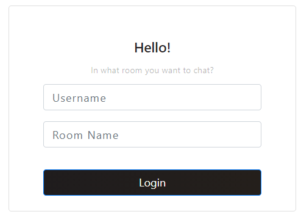

# Hello in my project! 👋👋
Crypto-Chat
> End-to-end encrypted chat using Redis, Socket.io, React, Docker, and Express. Messages are encrypted with asynchronous keys.

# Table of Contents
* [How to use](#how-to-use)
* [Algorithm](#algorithm)

# How to use
 
1. Give yourself a nice username.
2. Enter the room you want to communicate in. Remember that the application does not have a list of rooms saved anywhere, they are created ad hoc. If you want to talk about something super secret with a friend, remember - you both have to enter the exact name of the room.
