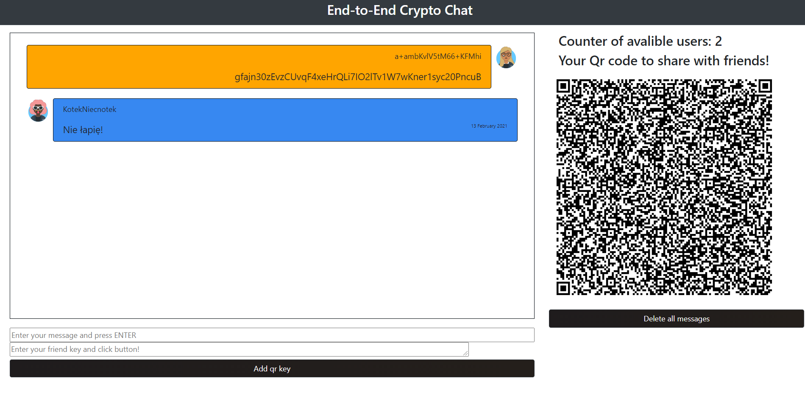
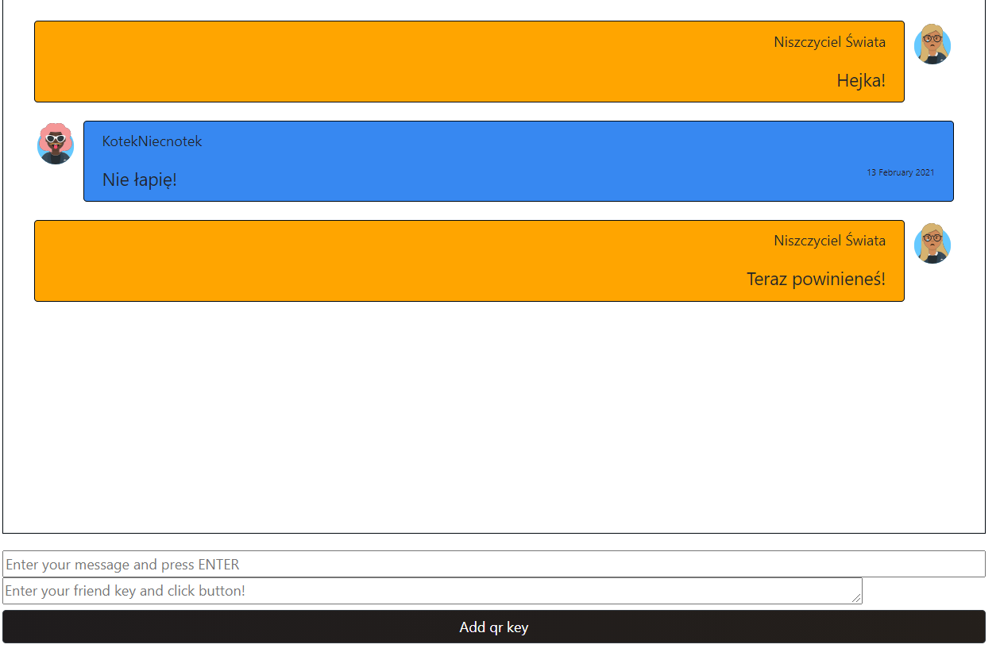

# Hello in my project! 👋👋
Crypto-Chat
> End-to-end encrypted chat using Redis, Socket.io, React, Docker, and Express. Messages are encrypted with asynchronous keys.

# Table of Contents
* [How to use](#how-to-use)
* [Algorithm](#algorithm)
* [Technologies](#technologies)

# How to use
 
1. Give yourself a nice username.  Don't worry too much if you have no idea. The application itself will generate a nickname referring to Star Wars. 
2. Enter the room you want to communicate in. Remember that the application does not have a list of rooms saved anywhere, they are created ad hoc. If you want to talk about something super secret with a friend, remember - you both have to enter the exact name of the room.
 

 

3. Share your QR code with a friend. Also, don't forget to get his QR code! Thanks to them you can decrypt your messages.

 

4. Enjoy!

# Alghoritm
Due to the use of the RSA algorithm, private and public keys can be used interchangeably, which I also used in this application. A private key is used to generate the QR code.

# Technologies
To ensure the greatest possible security of messages, a Redis cache is used. As soon as all users leave the chat, the entire room with sent messages is deleted. Additionally, each chat user can clear the chat history at any time.In order to connect the frontend and backend together, I used Docker-compose, and the Socket.io technology is used for sending messages
